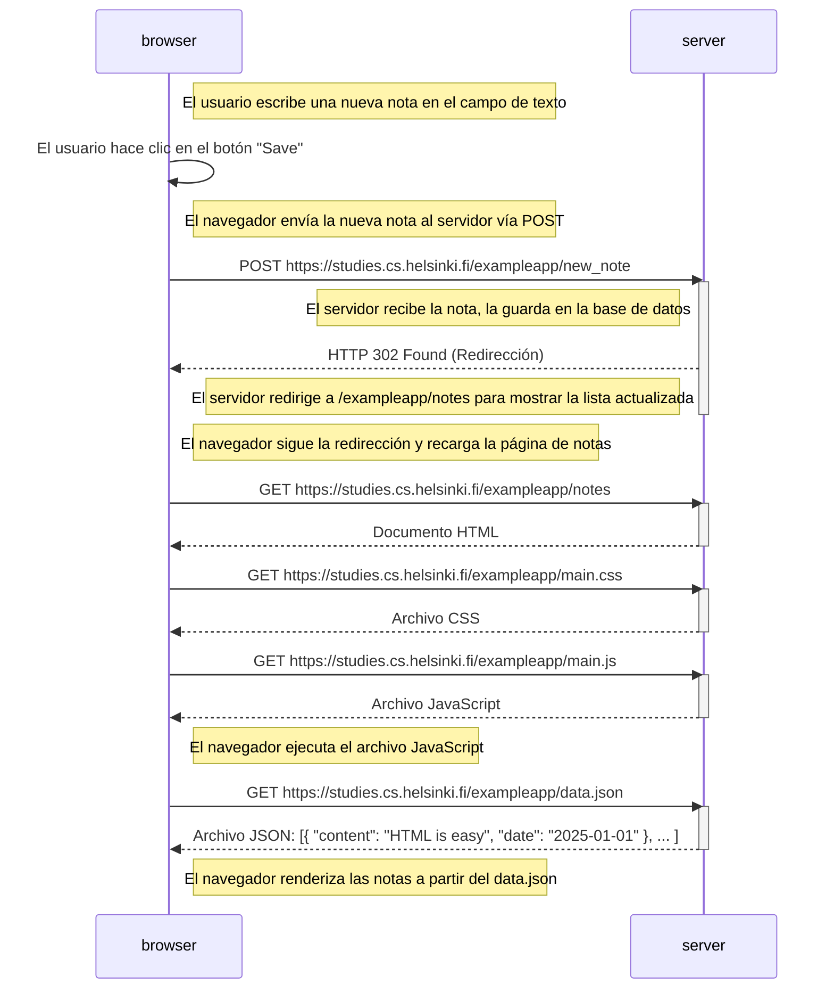

```mermaid

sequenceDiagram
    participant browser
    participant server

    Note right of browser: El usuario escribe una nueva nota en el campo de texto

    browser->>browser: El usuario hace clic en el botón "Save"

    Note right of browser: El navegador envía la nueva nota al servidor vía POST

    browser->>server: POST https://studies.cs.helsinki.fi/exampleapp/new_note
    activate server
    Note left of server: El servidor recibe la nota, la guarda en la base de datos
    server-->>browser: HTTP 302 Found (Redirección)
    Note left of server: El servidor redirige a /exampleapp/notes para mostrar la lista actualizada
    deactivate server

    Note right of browser: El navegador sigue la redirección y recarga la página de notas

    browser->>server: GET https://studies.cs.helsinki.fi/exampleapp/notes
    activate server
    server-->>browser: Documento HTML
    deactivate server

    browser->>server: GET https://studies.cs.helsinki.fi/exampleapp/main.css
    activate server
    server-->>browser: Archivo CSS
    deactivate server

    browser->>server: GET https://studies.cs.helsinki.fi/exampleapp/main.js
    activate server
    server-->>browser: Archivo JavaScript
    deactivate server

    Note right of browser: El navegador ejecuta el archivo JavaScript

    browser->>server: GET https://studies.cs.helsinki.fi/exampleapp/data.json
    activate server
    server-->>browser: Archivo JSON: [{ "content": "HTML is easy", "date": "2025-01-01" }, ... ]
    deactivate server

    Note right of browser: El navegador renderiza las notas a partir del data.json

```
