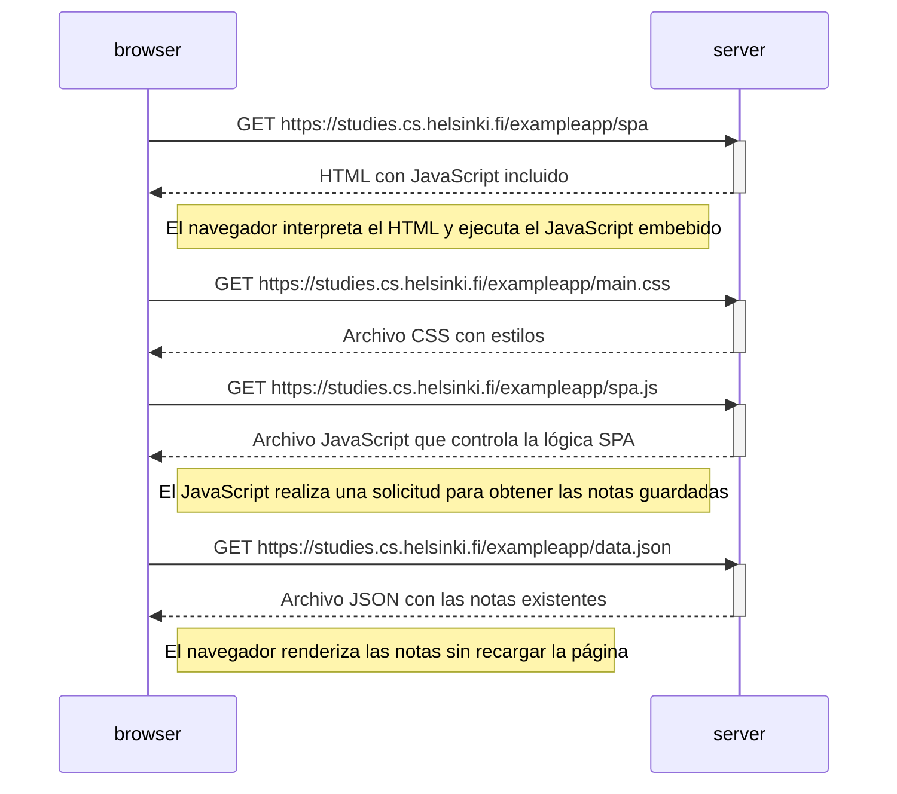

```mermaid

sequenceDiagram
    participant browser
    participant server

    browser->>server: GET https://studies.cs.helsinki.fi/exampleapp/spa
    activate server
    server-->>browser: HTML con JavaScript incluido
    deactivate server

    Note right of browser: El navegador interpreta el HTML y ejecuta el JavaScript embebido

    browser->>server: GET https://studies.cs.helsinki.fi/exampleapp/main.css
    activate server
    server-->>browser: Archivo CSS con estilos
    deactivate server

    browser->>server: GET https://studies.cs.helsinki.fi/exampleapp/spa.js
    activate server
    server-->>browser: Archivo JavaScript que controla la lógica SPA
    deactivate server

    Note right of browser: El JavaScript realiza una solicitud para obtener las notas guardadas

    browser->>server: GET https://studies.cs.helsinki.fi/exampleapp/data.json
    activate server
    server-->>browser: Archivo JSON con las notas existentes
    deactivate server

    Note right of browser: El navegador renderiza las notas sin recargar la página

```
