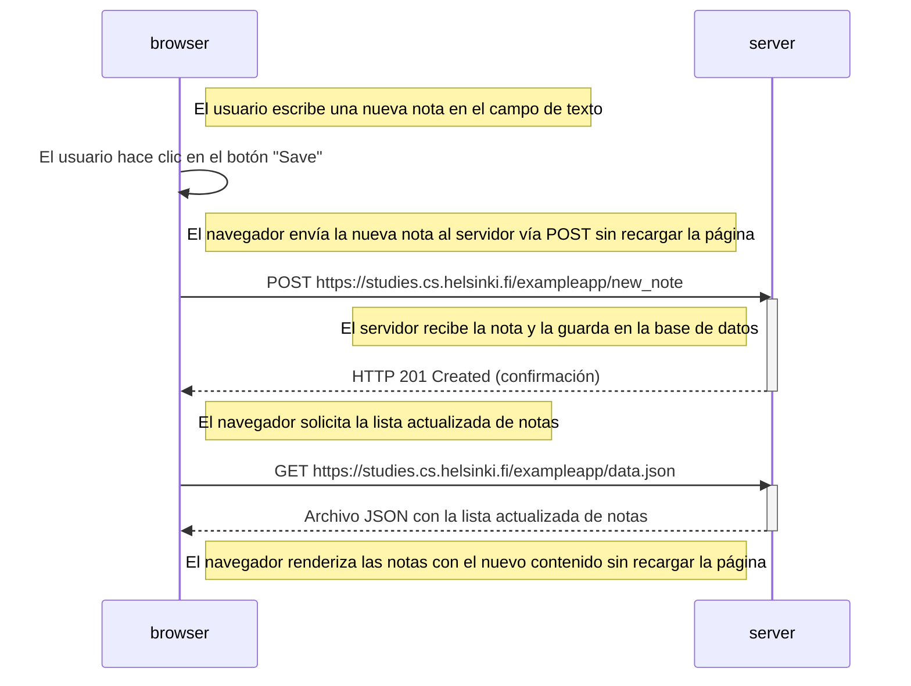

```mermaid

sequenceDiagram
    participant browser
    participant server

    Note right of browser: El usuario escribe una nueva nota en el campo de texto

    browser->>browser: El usuario hace clic en el botón "Save"

    Note right of browser: El navegador envía la nueva nota al servidor vía POST sin recargar la página

    browser->>server: POST https://studies.cs.helsinki.fi/exampleapp/new_note
    activate server
    Note left of server: El servidor recibe la nota y la guarda en la base de datos
    server-->>browser: HTTP 201 Created (confirmación)
    deactivate server

    Note right of browser: El navegador solicita la lista actualizada de notas

    browser->>server: GET https://studies.cs.helsinki.fi/exampleapp/data.json
    activate server
    server-->>browser: Archivo JSON con la lista actualizada de notas
    deactivate server

   Note right of browser: El navegador renderiza las notas con el nuevo contenido sin recargar la página

```
